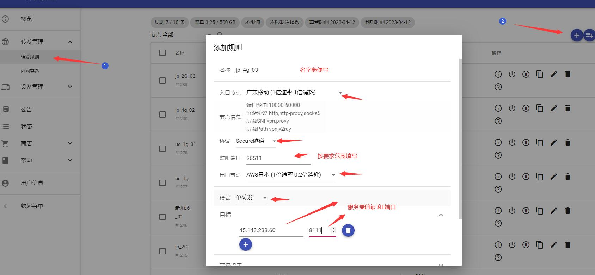
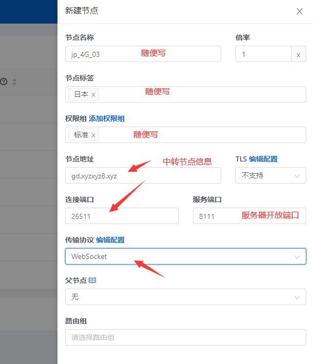
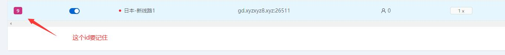
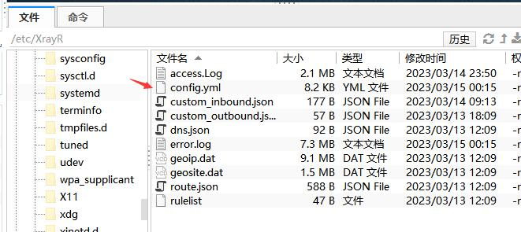

### v2board+xrayr+中转对接教程

#####1.搭建 aapanel

      安装命令：yum install -y wget && wget -O install.sh http://www.aapanel.com/script/install_6.0_en.sh && bash install.sh aapanel

      安装完成后，记录 网址和账号信息

#####2.安装 v2board

      官网搭建教程：https://v2board.com/deploy/aapanel.html

#####3.安装 XrayR

      官网搭建教程：https://xrayr-project.github.io/XrayR-doc/xrayr-xia-zai-he-an-zhuang/install/one-click.html

      常用命令：
      开启：XrayR start
      重启：XrayR restart
      日志：XrayR log

#####4.新增中转节点

#####5.服务器开启防火墙

      开放端口： firewall-cmd --permanent --add-port=8111/tcp
      查看端口列表：firewall-cmd --permanent --list-ports
      重启防火墙：firewall-cmd --reload

#####6.配置面板节点

#####7.配置 XrayR 节点

      打开这个文件编辑，改以下参数
      PanelType: "NewV2board"
      ApiHost: "http://xxxx.xxxx.xxxx.xxxx"  ip和域名都可以，写ip需要ip可以访问面板网站
      ApiKey: "sfsfasfafafafas"  这个值必须和 面板后台的 系统配置>节点>通讯密钥  一样
      NodeID: 9  这个和新建的节点id 必须一致
      CertMode: none  这个用none

      检测无误，保存重启
      XrayR restart
      XrayR log 日志无报错，即正常
